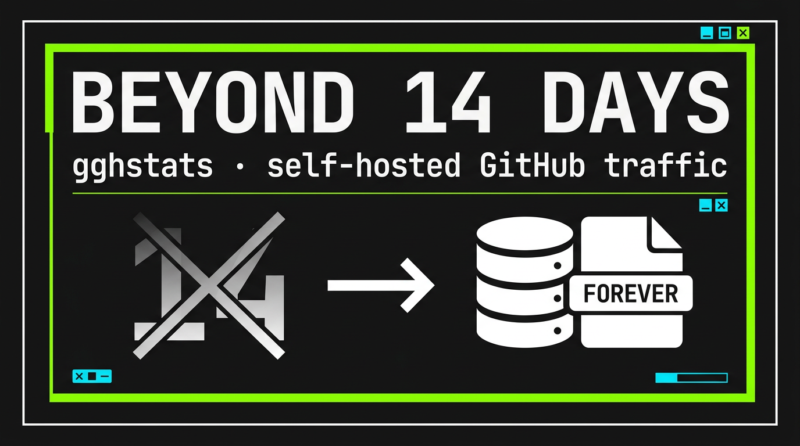
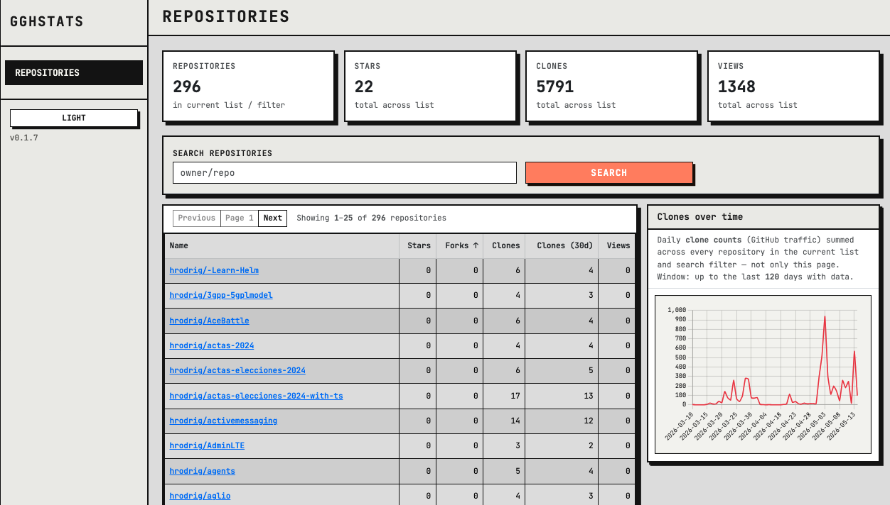

# gghstats



[](https://github.com/hrodrig/gghstats/releases)
[](https://github.com/hrodrig/gghstats/releases)
[](https://github.com/hrodrig/gghstats/actions)
[](https://codecov.io/gh/hrodrig/gghstats)
[](https://go.dev/)
[](https://opensource.org/licenses/MIT)
[](https://pkg.go.dev/github.com/hrodrig/gghstats)
[](https://goreportcard.com/report/github.com/hrodrig/gghstats)
[](https://deps.dev/go/github.com/hrodrig/gghstats)

**Repo:** [github.com/hrodrig/gghstats](https://github.com/hrodrig/gghstats) · **Releases:** [Releases](https://github.com/hrodrig/gghstats/releases)

Self-hosted dashboard and CLI for GitHub repository traffic stats. GitHub only keeps traffic for 14 days; `gghstats` keeps historical data indefinitely in SQLite.

If you want your **own self-hosted** deployment (Docker Compose, Traefik with TLS, Helm, optional Prometheus/Grafana/Loki), use the companion repo **[gghstats-selfhosted](https://github.com/hrodrig/gghstats-selfhosted)** — it lists the supported options and example manifests.

**Releases:** [GitHub Releases](https://github.com/hrodrig/gghstats/releases) ship binaries (tarballs/zip + checksums). **Multi-arch** container images (`linux/amd64`, `linux/arm64`) are on [GHCR](https://github.com/hrodrig/gghstats/pkgs/container/gghstats) as `ghcr.io/hrodrig/gghstats:v<version>` (same `v` prefix as the Git tag, e.g. `v0.1.3`) and `:latest`. Pushing a `v*` tag on `main` triggers the [Release workflow](.github/workflows/release.yml) (GoReleaser). Day-to-day work happens on `develop` (see [Release workflow](#release-workflow)).

## Demo

**Live:** [gghstats.hermesrodriguez.com](https://gghstats.hermesrodriguez.com)



## Table of contents

- [Demo](#demo)
- [Features](#features)
- [Repository page charts](#repository-page-charts-clones--views)
- [Quick start](#quick-start)
- [Install](#install)
- [Web UI assets (developers)](#web-ui-assets-developers)
- [Usage](#usage)
- [Examples](#examples)
- [Configuration](#configuration)
- [Environment file](#environment-file)
- [Typical scenarios](#typical-scenarios)
- [Deployments](#deployments)
- [Troubleshooting](#troubleshooting)
- [Release workflow](#release-workflow)
- [Security and quality](#security-and-quality)
- [Database](#database)
- [Community standards](#community-standards)
- [Acknowledgments](#acknowledgments)
- [License](#license)

## Features

- Collects views, clones, referrers, popular paths, and star history
- Auto-discovers repositories (or filters by org/repo rules)
- Web dashboard with Chart.js graphs
- JSON API for external integrations
- CLI mode for fetch/report/export
- Single binary, SQLite storage, no external DB dependency
- Docker image on GHCR; Compose / Helm examples live in **[gghstats-selfhosted](https://github.com/hrodrig/gghstats-selfhosted)**

### Repository page charts (Clones & Views)

On each repository’s detail page, the **Clones** and **Views** bar charts are **stacked** from GitHub’s daily traffic API:

| Segment | Meaning | GitHub field |
|--------|---------|--------------|
| **Lower** (theme primary color) | Unique visitors or cloners that day | `uniques` |
| **Upper** (theme info color) | Total views or total clones that day | `count` |

Exact colors depend on light/dark theme (Bootstrap `--bs-primary` / `--bs-info`, overridden in the app’s neo-brutalist CSS). The legend is hidden on the chart; use the tooltip on each bar for values.

[Back to top](#gghstats)

## Quick start

### Docker Compose (build from this repo)

```bash
cp .env.example .env
# Edit .env: set GGHSTATS_GITHUB_TOKEN (and optionally GGHSTATS_FILTER, GGHSTATS_PORT, etc.)
docker compose up -d --build
```

Open <http://localhost:8080>.

The template [`.env.example`](.env.example) lists variables for the **Go binary** and this dev Compose file. Production (Traefik, published image, Helm, observability) is in **[gghstats-selfhosted](https://github.com/hrodrig/gghstats-selfhosted)**.

### Plain Docker

```bash
docker run -d \
  -e GGHSTATS_GITHUB_TOKEN=ghp_xxx \
  -e GGHSTATS_FILTER="your-github-user/*" \
  -p 8080:8080 \
  -v ./data:/data \
  --name gghstats \
  ghcr.io/hrodrig/gghstats:v0.1.3
```

[Back to top](#gghstats)

## Install

### Go install

```bash
go install github.com/hrodrig/gghstats/cmd/gghstats@latest
```

### Pre-built binary and container

- **Binary archives:** [Releases](https://github.com/hrodrig/gghstats/releases) (pick OS/arch; verify `checksums.txt`).
- **OCI image:** `ghcr.io/hrodrig/gghstats:v0.1.3` or `ghcr.io/hrodrig/gghstats:latest` (image tag matches the Git release tag; multi-arch manifest).

### Build from source

```bash
git clone https://github.com/hrodrig/gghstats.git
cd gghstats
make install
```

### Web UI assets (developers)

Favicons and the [web app manifest](https://developer.mozilla.org/en-US/docs/Web/Progressive_web_apps/Manifest) live under [`assets/favicons/`](assets/favicons/) and are embedded at build time via [`assets/embed.go`](assets/embed.go) (`go:embed favicons/*`). The HTTP server exposes each file under `/static/<filename>` (see table). Other UI assets (CSS, Bootstrap) remain under [`web/static/`](web/static/) via [`web/embed.go`](web/embed.go).

| File | Role |
|------|------|
| [`assets/favicons/favicon.svg`](assets/favicons/favicon.svg) | **Source artwork** (vector). Edit this when changing the mark; regenerate the raster files below. |
| [`assets/favicons/favicon-16x16.png`](assets/favicons/favicon-16x16.png) | PNG **16×16** (tabs, legacy). |
| [`assets/favicons/favicon-32x32.png`](assets/favicons/favicon-32x32.png) | PNG **32×32**. |
| [`assets/favicons/favicon.ico`](assets/favicons/favicon.ico) | Multi-size **ICO** (16 + 32). |
| [`assets/favicons/apple-touch-icon.png`](assets/favicons/apple-touch-icon.png) | **180×180** (iOS / “Add to Home Screen”). |
| [`assets/favicons/android-chrome-192x192.png`](assets/favicons/android-chrome-192x192.png) | **192×192** (PWA / Android). |
| [`assets/favicons/android-chrome-512x512.png`](assets/favicons/android-chrome-512x512.png) | **512×512** (PWA splash / install). |
| [`assets/favicons/manifest.json`](assets/favicons/manifest.json) | [Web app manifest](https://developer.mozilla.org/en-US/docs/Web/Progressive_web_apps/Manifest) (`/static/manifest.json`; linked from `layout.html`). |

**Regenerating rasters after you change `favicon.svg`:** from the repository root, with [librsvg](https://wiki.gnome.org/Projects/LibRsvg) (`rsvg-convert`) and [ImageMagick](https://imagemagick.org/) (`magick`) on your `PATH`:

```bash
SVG=assets/favicons/favicon.svg
rsvg-convert -w 16  -h 16  "$SVG" -o assets/favicons/favicon-16x16.png
rsvg-convert -w 32  -h 32  "$SVG" -o assets/favicons/favicon-32x32.png
rsvg-convert -w 180 -h 180 "$SVG" -o assets/favicons/apple-touch-icon.png
rsvg-convert -w 192 -h 192 "$SVG" -o assets/favicons/android-chrome-192x192.png
rsvg-convert -w 512 -h 512 "$SVG" -o assets/favicons/android-chrome-512x512.png
magick assets/favicons/favicon-16x16.png assets/favicons/favicon-32x32.png assets/favicons/favicon.ico
```

Commit everything under `assets/favicons/` together so all icons stay in sync.

[Back to top](#gghstats)

## Usage

### Server mode (recommended)

```bash
export GGHSTATS_GITHUB_TOKEN="ghp_your_token"
gghstats serve
```

Server behavior:

- Runs initial sync when database is empty
- Re-syncs on schedule (default `1h`)
- Serves dashboard on <http://localhost:8080>
- Stores data in `./data/gghstats.db`
- Liveness/readiness: `GET /api/v1/healthz` → `{"status":"ok"}` (no auth; Kubernetes-style)
- Prometheus: `GET /metrics` (disable with `GGHSTATS_METRICS=false`)
- Listen port: `GGHSTATS_PORT` (default `8080`) or `gghstats serve --port <port>`
- First stderr line on start: version, build date, `GOOS`/`GOARCH`, listen address, masked GitHub token (`XXXX....YYYY`); then slog at `GGHSTATS_LOG_LEVEL` (default `info`). Every structured slog line is prefixed with `gghstats ` so it is easy to grep in shared log streams.

### CLI mode

```bash
gghstats fetch --repo your-github-user/my-app --token "$GGHSTATS_GITHUB_TOKEN"
gghstats report --repo your-github-user/my-app --token "$GGHSTATS_GITHUB_TOKEN"
gghstats export --repo your-github-user/my-app --token "$GGHSTATS_GITHUB_TOKEN" --output traffic.csv
```

[Back to top](#gghstats)

## Examples

### Start server with explicit DB path and interval

```bash
GGHSTATS_GITHUB_TOKEN=ghp_xxx \
GGHSTATS_DB=./data/gghstats.db \
GGHSTATS_SYNC_INTERVAL=30m \
gghstats serve
```

### Fetch/report/export for one repository

Use your repository as `owner/repo` (example below uses a placeholder).

```bash
gghstats fetch --repo your-github-user/my-app --token "$GGHSTATS_GITHUB_TOKEN"
gghstats report --repo your-github-user/my-app --token "$GGHSTATS_GITHUB_TOKEN" --days 14
gghstats export --repo your-github-user/my-app --token "$GGHSTATS_GITHUB_TOKEN" --days 30 --output traffic-30d.csv
```

### Run strict pre-release checks (includes container scan)

```bash
make release-check STRICT_RELEASE=1
```

### Local release dry-run flow

```bash
make snapshot
make test-release
```

[Back to top](#gghstats)

## Configuration

All runtime configuration uses env vars (`serve`) or flags (`fetch/report/export`).

### Environment file

- **Template:** [`.env.example`](.env.example) — copy to `.env` and fill in secrets. `.env` is gitignored (dotfiles are excluded by default in this repo).
- **Compose:** `docker compose` loads `.env` from the project directory automatically.

### Environment variables (serve)

| Variable | Default | Description |
| --- | --- | --- |
| `GGHSTATS_GITHUB_TOKEN` | (required) | GitHub personal access token |
| `GGHSTATS_DB` | `./data/gghstats.db` | SQLite database path |
| `GGHSTATS_HOST` | `0.0.0.0` | Bind address |
| `GGHSTATS_PORT` | `8080` | Listen port |
| `GGHSTATS_FILTER` | `*` | Repo filter expression |
| `GGHSTATS_INCLUDE_PRIVATE` | `false` | Include private repos |
| `GGHSTATS_SYNC_INTERVAL` | `1h` | Sync frequency |
| `GGHSTATS_API_TOKEN` | (none) | Protect `/api/*` endpoints |
| `GGHSTATS_LOG_LEVEL` | `info` | `debug`, `info`, `warn`, or `error` (slog only; startup banner always prints) |
| `GGHSTATS_METRICS` | (enabled) | Set to `false` to disable `GET /metrics` |

### Token setup

1. Go to <https://github.com/settings/tokens>
2. Generate a classic token
3. Use `public_repo` scope (or `repo` for private repos)

### Filter examples

Replace `your-github-user` with your GitHub username or organization, and `my-app` / `other-repo` / `legacy-repo` with your real repository names.

```bash
GGHSTATS_FILTER="your-github-user/*"
GGHSTATS_FILTER="your-github-user/my-app,your-github-user/other-repo"
GGHSTATS_FILTER="*,!fork"
GGHSTATS_FILTER="*,!archived"
GGHSTATS_FILTER="your-github-user/*,!fork,!archived"
GGHSTATS_FILTER="*,!your-github-user/legacy-repo"
```

### API

When `GGHSTATS_API_TOKEN` is configured:

```bash
curl -H "x-api-token: your-token" http://localhost:8080/api/repos
```

[Back to top](#gghstats)

## Typical scenarios

### Track all repositories for one owner

```bash
export GGHSTATS_FILTER="your-github-user/*"
gghstats serve
```

### Exclude forks and archived repositories

```bash
export GGHSTATS_FILTER="your-github-user/*,!fork,!archived"
gghstats serve
```

### Protect API with token

```bash
export GGHSTATS_API_TOKEN="my-api-token"
gghstats serve
curl -H "x-api-token: my-api-token" http://localhost:8080/api/repos
```

### Generate periodic CSV report

```bash
gghstats export --repo your-github-user/my-app --days 30 --output traffic-30d.csv
```

[Back to top](#gghstats)

## Deployments

Production and optional observability (Traefik + TLS, Prometheus / Grafana stack, Helm) live in a separate repository so release versioning applies to the **application** only. For self-hosted setups, start here:

**[github.com/hrodrig/gghstats-selfhosted](https://github.com/hrodrig/gghstats-selfhosted)**

Clone that repo on your server, copy `.env.example` → `.env`, and follow its README for the deployment path you choose. For the optional metrics/logs stack, see **[run/docker-compose/observability/README.md](https://github.com/hrodrig/gghstats-selfhosted/blob/main/run/docker-compose/observability/README.md)** (on the default branch).

[Back to top](#gghstats)

## Troubleshooting

### `GGHSTATS_GITHUB_TOKEN is required`

Set `GGHSTATS_GITHUB_TOKEN` in your shell or `.env` file before running `serve`.

### Dashboard shows no repositories

- Wait for the initial sync to finish.
- Verify filter rules (`GGHSTATS_FILTER`) are not excluding all repos.
- Confirm token scope includes repository metadata access.

### Port `8080` already in use

Set another listen port via env or flag:

```bash
export GGHSTATS_PORT=9090
gghstats serve
# or: gghstats serve --port 9090
```

### API returns `401 unauthorized`

Confirm request header exactly matches configured token:

```bash
curl -H "x-api-token: $GGHSTATS_API_TOKEN" http://localhost:8080/api/repos
```

[Back to top](#gghstats)

## Release workflow

- Branch policy: day-to-day development on `develop`; **tagged releases** are cut from **`main`**.
- **`VERSION`** file: semantic version **without** `v` (for example `0.1.3`). Must match the static **Version** badge at the top of this README.
- **Git tags:** annotated tag **with** `v` prefix (for example `v0.1.3`), on the commit you want released.

### Default: publish from GitHub Actions (no local GoReleaser required)

Pushing a tag matching `v*` runs [`.github/workflows/release.yml`](.github/workflows/release.yml): `make release-check`, then `goreleaser release --clean` with `GITHUB_TOKEN` (releases + **GHCR**).

```bash
# 1) On develop: land changes, bump version if needed
git checkout develop
make release-check                    # optional: STRICT_RELEASE=1 (adds docker image scan)
make test-release                     # optional: dry-run GoReleaser + local Docker build

# 2) Update VERSION, README version badge, CHANGELOG; commit on develop

# 3) Merge into main (PR or fast-forward), then tag and push
git checkout main && git pull origin main
git merge --ff-only develop           # or: merge via GitHub PR
git push origin main

git tag -a v0.1.3 -m "Release 0.1.3"
git push origin v0.1.3                # triggers Release workflow — builds and publishes artifacts
```

For the **next** release after `0.1.3`, set `VERSION` to `0.1.4` (etc.), update the badge and [CHANGELOG](CHANGELOG.md), then repeat with `v0.1.4`.

### Optional: publish from your machine

If you run GoReleaser locally instead of relying on CI, checkout **`main`** at the tagged commit, export **`GITHUB_TOKEN`** (or **`GH_TOKEN`**) with `repo` and **packages** access to push GHCR, then:

```bash
make release                          # runs release-check then goreleaser release --clean
```

### Developer checklist

- Update **`CHANGELOG.md`** (move `[Unreleased]` into the new version section).
- Keep **`VERSION`** (no `v`), README **Version** badge, and [CHANGELOG](CHANGELOG.md) in sync; the OCI tag uses the same `v` prefix as the Git tag. Deployment image pins live in **gghstats-selfhosted**.
- Ensure **CI** and **Security** workflows are green before pushing the release tag.
- **Docker:** `Dockerfile` is for local `make docker-build` / `docker-scan`. **GoReleaser** uses **`Dockerfile.release`** (pre-built Linux binaries; same pattern as multi-arch release images).

[Back to top](#gghstats)

## Security and quality

```bash
make tools
make lint
make test
make security
make release-check
```

Security tooling:

- `govulncheck`
- `gocyclo` (complexity gate)
- `grype` (filesystem image/source scanning)

[Back to top](#gghstats)

## Database

SQLite path comes from `GGHSTATS_DB`. Main tables: `repos`, `views`, `clones`, `referrers`, `paths`, `stars`.

- Upserts are idempotent
- Startup migration uses `PRAGMA user_version`

[Back to top](#gghstats)

## Community standards

- License: `LICENSE`
- Contributing: `CONTRIBUTING.md`
- Code of conduct: `CODE_OF_CONDUCT.md`
- Security policy: `SECURITY.md`
- Changelog: `CHANGELOG.md`
- CODEOWNERS: `.github/CODEOWNERS`

Thanks for using and contributing to `gghstats`.

[Back to top](#gghstats)

## Acknowledgments

Hats off to **[ghstats](https://github.com/vladkens/ghstats)** by [vladkens](https://github.com/vladkens): a self-hosted GitHub traffic dashboard in **Rust** that also keeps historical traffic beyond GitHub’s short default window, with SQLite and a small deployment story. `gghstats` is a separate **Go** implementation and design, but that project deserves credit as important prior work in the same problem space.

[Back to top](#gghstats)

## License

MIT
